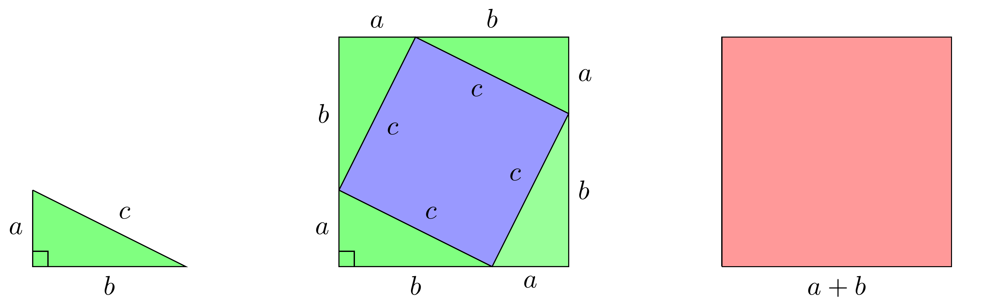

# Pythagoraan lause

Visa ja Fanny suunnitelevat ja koodaavat työkseen tietokonepelejä. He käyttävät tähän Unity-pelimoottoria. Pelimoottorissa pelimaailma esitetään rautalankamallina erilaisilla monikulmioilla, joista tärkein on kolmio: 


```{r, echo=FALSE,out.width="100%",out.height="40%",fig.cap="Pelimaailma",fig.show='hold',fig.align='center'}
knitr::include_graphics(c("img/renderoity.png","img/rautalanka.png"))
```

Peleissä kolmioita käytetään myös määrittämään pelaajan etäisyys pelimaailman esineistä ja muodoista. Pelaajan ja esineiden paikka kartalla määritetään koordinaateilla. Tällöin etäisyyden määritys voidaan tehdä piirtämällä suorakulmainen kolmio, selvittämällä koordinaattien avulla kolmion kateettien pituudet ja laskemalla kolmion hypotenuusan pituus.

**Tähän appletti, jolla oppilas voi laskea kolmion hypotenuusan pituuden.**


Sama tavalla voidaan toimia minkä tahansa suorakulmaisen kolmion kanssa. Piirretään tämän osoittamiseksi ensin vihreä suorakulmainen kolmio, jonka kateettien pituudet ovat $a$ ja $b$ sekä hypotenuusan pituus $c$. Piirretään sitten hypotenuusaan kiinni sininen neliö ja kopioidaan kolmiota neliön ympärille kuvan \@ref(fig:pythagoras-theorem) mukaisesti. Yhdessä neljä vihreää kolmiota ja sininen neliö muodostavat kuvan \@ref(fig:pythagoras-theorem) ison punaisen neliön, jonka sivun pituus on $a+b$, eli summa kolmion kateettien pituuksista.
```{r pythagoras-theorem, echo=FALSE, out.width="100%", out.height="40%", fig.cap="Pythagoraan lauseen johto", fig.show='hold', fig.align='center'}

```
Nyt voidaan laskea ison punaisen neliön pinta-alaksi
\begin{equation*}
  (a+b)^2=\color{red}{a^2+2ab+b^2}
\end{equation*}
neljän vihreän kolmion yhteenlasketuksi pinta-alaksi
\begin{equation*}
  4 \frac{ab}{2}=\color{green}{2ab}
\end{equation*}
sekä pienen sinisen neliön pinta-alaksi
\begin{align*}
  \color{blue}{c^2}
\end{align*}
Pienen sinisen neliön pinta-ala on yhtäsuuri kuin ison neliön ja kolmioiden yhteenlasketun pinta-alan erotus
\begin{align*}
  \color{blue}{\text{Pieni nelio}}&=\color{red}{\text{Iso nelio}}- \color{green}{\text{neljä kolmiota}}\\
  \color{blue}{c^2}&= \color{red}{a^2+2ab+b^2} - \color{green}{2ab}\\
  c^2&= a^2+b^2
\end{align*}
Tämä tulos tunnetaan Pythagoraan lauseena. Kateettien neliöiden summa on hypotenuusan neliöiden summa. Pythagoraan lauseen avulla hypotenuusan pituus voidaan laskea kateettien pituuksista yhtälöllä
\begin{align*}
  c=\sqrt{a^2+b^2}
\end{align*}
ja tätä yhtälöä käyttäen peleissä selvittää pelaajan etäisyys pelimaailman esineistä ja muodoista.

