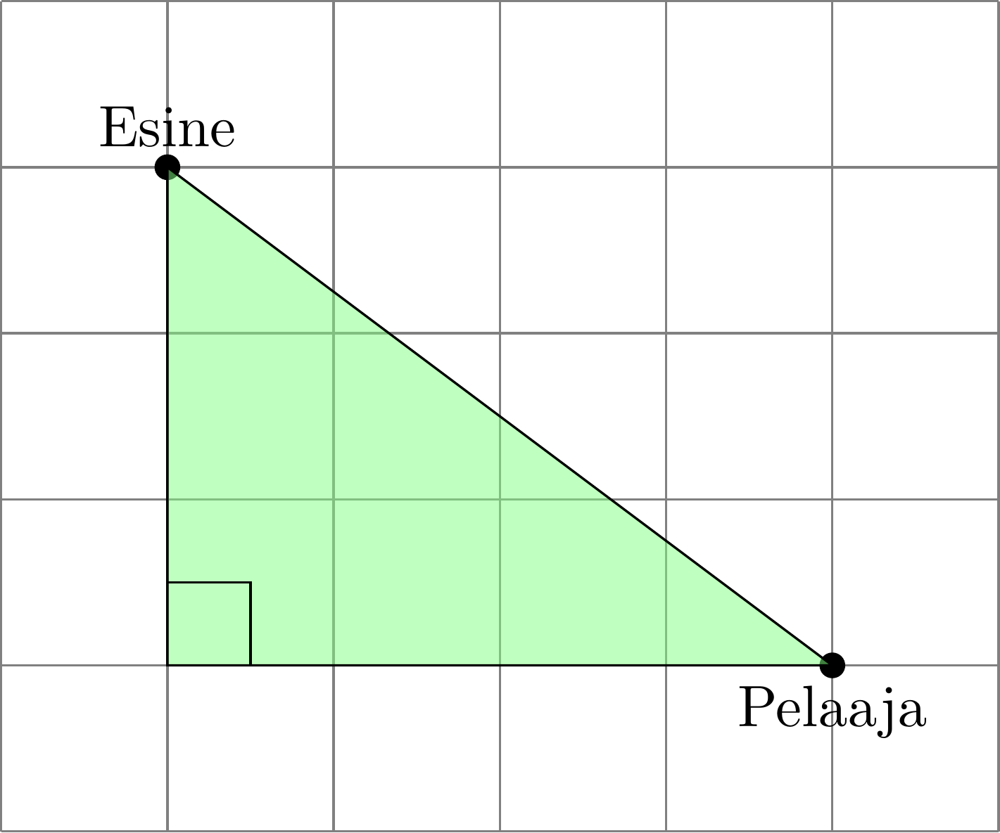

# Pythagoraan lause

Visa ja Fanny suunnitelevat ja koodaavat työkseen tietokonepelejä. He käyttävät tähän Unity-pelimoottoria. Pelimoottorissa pelimaailma esitetään rautalankamallina erilaisilla monikulmioilla, joista tärkein on kolmio.
```{r, echo=FALSE,out.width="80%",out.height="40%",fig.cap="Pelimaailma rakennetaan kolmioista",fig.show='hold',fig.align='center'}
knitr::include_graphics(c("img/renderoity.png","img/rautalanka.png"))
```

Peleissä kolmioita käytetään määrittämään myös pelaajan etäisyys pelimaailman esineistä ja muodoista. Ensin pelaajan ja esineiden paikka kartalla määritetään koordinaateilla. Sitten koordinaattien avulla piirretään suorakulmainen kolmio kuvan \@ref(fig:pelaaja-esine-kolmio) mukaisesti. 
```{r pelaaja-esine-kolmio, echo=FALSE,out.width="40%",out.height="40%",fig.cap="Pelaaja, esine ja suorakulmainen kolmio koordinaatistossa",fig.show='hold',fig.align='center'}

```
Näin pelaajan ja esineen etäisyys saadaan selville laskemalla suorakulmaisen kolmion hypotenuusan pituus. Mutta kuinka hypotenuusan pituus lasketaan? Selvitetäänpä tämä mysteeri pohtimalla seuraavia kysymyksiä:
```{r, eval=knitr::is_html_output(excludes = "epub"), results = 'asis', echo = F}
cat(
'<iframe width="100%" height="450" 
  src="https://www.geogebra.org/material/iframe/id/ptquw8jj/width/700/height/472/border/FFFFFF/sfsb/true/smb/false/stb/false/stbh/false/ai/false/asb/false/sri/false/rc/false/ld/false/sdz/false/ctl/false"
  frameborder="0" allow="accelerometer; autoplay; encrypted-media;
  gyroscope; picture-in-picture" allowfullscreen>
  </iframe>'
)
```
Huomataan, että sinisen neliön pinta-ala on yhtä suuri kuin vihreän kolmion kateettien neliöiden summa. Koska vihreän kolmion hypotenuusa on myös sinisen neliön sivu, voidaan todeta:

**Suorakulmaisen kolmion kateettien neliöiden summa on hypotenuusan neliö:**
\begin{align*}
  3^2+4^2=5^2
\end{align*}

**Suorakulmaisen kolmion hypotenuusan pituus on neliöjuuri kateettien neliöiden summasta:**
\begin{align*}
  5=\sqrt{3^2+4^2}
\end{align*}

Hieno havainto! Mutta päteekö tämä tulos kaikille suorakulmaisille kolmioille? Mitä tapahtuu, jos kateettien pituudet eivät olekaan 3 ja 4? Tutkitaan asiaa piirtämällä kuvaan \@ref(fig:pythagoras-theorem) punainen nelio, neljä vihreää kolmiota ja sininen neliö uudestaan, mutta oletetaan kolmion kateettien pituuksiksi nyt $a$ ja $b$ sekä hypotenuusan pituudeksi $c$. Lasketaan näillä tiedoilla myös eri väristen alueiden pinta-alat:
```{r pythagoras-theorem, echo=FALSE, out.width="100%", out.height="40%", fig.cap="Pinta-alojen laskeminen", fig.show='hold', fig.align='center'}

```
Muistetaan, että sinisen neliön pinta-ala saadaan vähentämällä punaisen neliön pinta-alasta neljän vihreän kolmion yhteenlaskettu pinta-ala:
\begin{align*}
 \color{red}{\text{Punainen neliö }}- \color{green}{\text{ vihreät kolmiot }}&=\color{blue}{\text{ sininen neliö}},\\
  \color{red}{(a+b)^2} - \color{green}{4\frac{ab}{2}}&=\color{blue}{c^2},\\
  \color{red}{a^2+2ab+b^2} - \color{green}{2ab}&=\color{blue}{c^2}.
\end{align*}
Koska $\color{red}{2ab} - \color{green}{2ab}=0$, saadaan lopulta tärkeä tulos:

**Pythagoraan lause:**

Olkoon suorakulmaisen kolmion kateettien pituudet $a$ ja $b$ sekä hypotenuusan pituus $c$. Tällöin 
\begin{equation*}
  a^2+b^2=c^2.
\end{equation*}
Aivan kuten aiemmin jo havaitsit, kateettien neliöiden summa on hypotenuusan neliö. Ja nyt tiedämme tuloksen pätevän kaikille suorakulmaisille kolmioille! Pythagoraan lauseen avulla hypotenuusan pituus voidaan laskea kateettien pituuksista yhtälöllä
\begin{align*}
  c=\sqrt{a^2+b^2}.
\end{align*}
Näin pelaajan etäisyys pelimaailman esineistä saadaan laskettua, oli pelaaja kartalla missä tahansa. Harjoitellaan seuraavaksi Pythagoraan lauseen käyttöä tehtävillä.

```{exercise ,echo=TRUE}
Tähän kirjataan tehtävä: Olkoon $a$ ja $b$ sekä $c$. Tällöin 
\begin{equation*}
  a-b=c
\end{equation*}
Laske $c-b$.
```
```{exercise ,echo=TRUE}
Tähän kirjataan toinen tehtävä: laske
\begin{equation*}
  a-b=c
\end{equation*}
```
```{exercise ,echo=TRUE}
Tähän kirjataan kolmas tehtävä: Olkoon $a$ ja $b$ sekä $c$. Tällöin 
\begin{equation*}
  a-b=c
\end{equation*}
Laske $c-b$.
```


